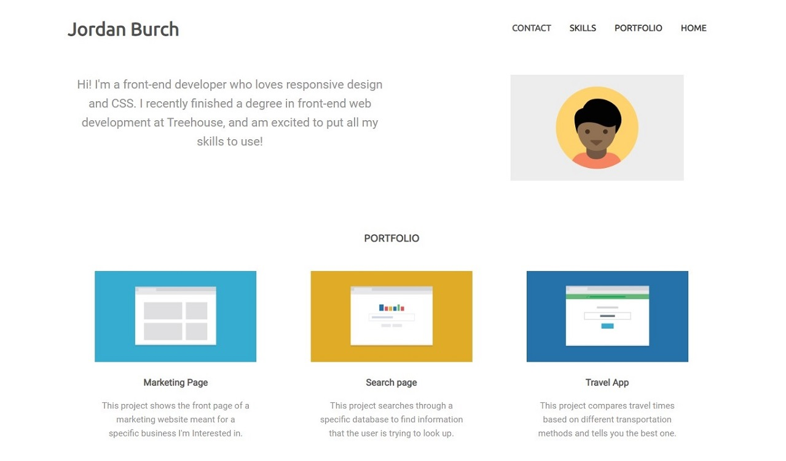

# Teachdegree-project 2
> Mobile-first layout built using HTML and CSS to demonstrate responsive design by 
adjusting to accommodate small, medium, and large screen sizes.

## Table of contents
* [General info](#general-info)
* [Screenshots](#screenshots)
* [Technologies](#technologies)
* [Features](#features)
* [Contact](#contact)

## General info
The second project that I built as a template that someone could use as a basic portfolio. 
It features animated buttons, responsive sizing built from the ground up to be mobile-friendly.

## Screenshots

## Technologies
* CSS3
* HTML5

## Features
List of features ready and TODOs for future development
* Hover effect over buttons
* Basic float layout
* Mobile-first design

To-do list:
* Convert CSS to SASS

## Contact
Created by [@JordanBurch101](https://github.com/Jordanburch101) - feel free to contact me!